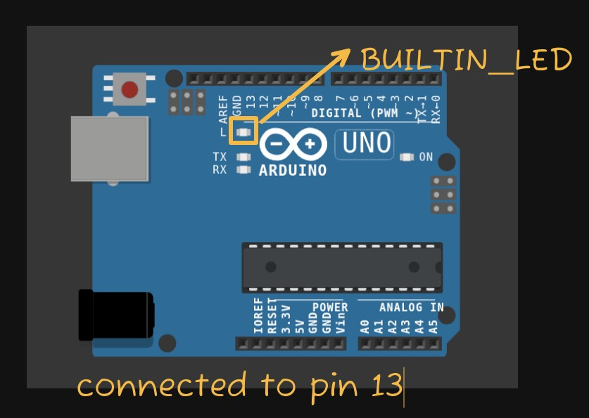

# Arduino LED Blink

A simple beginner Arduino project that demonstrates how to blink an LED using basic Arduino programming functions.

This project introduces the fundamentals of:

* `const int`
* `setup()`
* `loop()`
* `pinMode()`
* `digitalWrite()`
* `delay()`

## 🛠️ Components Required

* Arduino Uno

The Arduino Uno's built-in LED is used, so no external LED or resistor is required.

## 🔌 Circuit



The built-in LED on the Arduino Uno is connected internally to **digital pin 13**.

## 💻 Code

```cpp
// Arduino LED Blink
// Basic example using pinMode(), digitalWrite(), and delay()

const int ledPin = 13;

void setup() {
  // Set LED pin as an output
  pinMode(ledPin, OUTPUT);
}

void loop() {
  // Turn LED ON
  digitalWrite(ledPin, HIGH);
  delay(1000);

  // Turn LED OFF
  digitalWrite(ledPin, LOW);
  delay(1000);
}
```

## 🧠 Line-by-Line Explanation

### `// Arduino LED Blink`

```cpp
// Arduino LED Blink
```

`//` starts a **comment**.

Comments are ignored by the Arduino and are only written to help humans understand the code.

Here, the comment tells us the purpose of the program.

---

### `// Basic example using...`

```cpp
// Basic example using pinMode(), digitalWrite(), and delay()
```

This is another comment.

It tells us which important Arduino functions are being demonstrated in this project.

---

### `const int ledPin = 13;`

```cpp
const int ledPin = 13;
```

This line creates a variable called `ledPin`.

Let's break it down:

* `const` → the value cannot be changed later in the program.
* `int` → the variable stores an integer (whole number).
* `ledPin` → the name we give to the variable.
* `=` → assigns a value.
* `13` → the digital pin number.
* `;` → marks the end of the statement.

So:

```text
ledPin = 13
```

means that whenever we use `ledPin` later, the Arduino knows that we are referring to **digital pin 13**.

---

### `void setup()`

```cpp
void setup() {
```

`setup()` is a special Arduino function.

It runs **once** when the Arduino starts or resets.

The `{` marks the beginning of the code inside `setup()`.

In this project, we use `setup()` to configure the LED pin.

---

### `pinMode(ledPin, OUTPUT);`

```cpp
pinMode(ledPin, OUTPUT);
```

`pinMode()` tells the Arduino how a pin will be used.

It has two important parts:

```text
pinMode(pin, mode)
```

Here:

```text
ledPin → pin 13
OUTPUT → Arduino will send a signal through this pin
```

So this line means:

> Set digital pin 13 as an output.

An output pin can be controlled by the Arduino using `digitalWrite()`.

---

### `}`

```cpp
}
```

This closes the `setup()` function.

The Arduino has now finished the instructions that need to run once.

---

### `void loop()`

```cpp
void loop() {
```

`loop()` is another special Arduino function.

Unlike `setup()`, it runs **repeatedly for as long as the Arduino has power**.

The Arduino essentially does:

```text
loop()
↓
loop()
↓
loop()
↓
loop()
↓
...
```

This is what allows the LED to keep blinking continuously.

---

### `digitalWrite(ledPin, HIGH);`

```cpp
digitalWrite(ledPin, HIGH);
```

`digitalWrite()` changes the state of a digital output pin.

The basic syntax is:

```cpp
digitalWrite(pin, state);
```

Here:

```text
ledPin → pin 13
HIGH   → HIGH voltage / ON state
```

Therefore, this line turns the LED **ON**.

---

### `delay(1000);`

```cpp
delay(1000);
```

`delay()` pauses the program for a specific amount of time.

The value is measured in **milliseconds**.

```text
1000 milliseconds = 1 second
```

So the Arduino keeps the LED ON for **1 second**.

---

### `digitalWrite(ledPin, LOW);`

```cpp
digitalWrite(ledPin, LOW);
```

This changes pin 13 to `LOW`.

For the built-in LED:

```text
HIGH → ON
LOW  → OFF
```

Therefore, this line turns the LED **OFF**.

---

### `delay(1000);`

```cpp
delay(1000);
```

The Arduino waits another **1 second** while the LED is OFF.

After this delay, the `loop()` function reaches its end.

The Arduino then automatically starts `loop()` again.

---

### Final `}`

```cpp
}
```

This marks the end of the `loop()` function.

After reaching this point, Arduino automatically goes back to:

```cpp
void loop()
```

and repeats the entire sequence.

## 🔄 How the Program Works

The complete process is:

```text
Arduino starts
      ↓
setup() runs once
      ↓
Pin 13 is configured as OUTPUT
      ↓
loop() starts
      ↓
LED ON
      ↓
Wait 1 second
      ↓
LED OFF
      ↓
Wait 1 second
      ↓
loop() starts again
      ↓
Repeat forever
```

## ⏱️ Changing the Blink Speed

You can change the value inside `delay()` to change how fast the LED blinks.

For example:

```cpp
delay(500);
```

means:

```text
500 ms = 0.5 seconds
```

So the LED changes state every half second.

Other examples:

|  Delay |         Time |
| -----: | -----------: |
|  `100` |  0.1 seconds |
|  `250` | 0.25 seconds |
|  `500` |  0.5 seconds |
| `1000` |     1 second |
| `2000` |    2 seconds |

## 📚 Arduino Functions Used

| Function         | Purpose                                 |
| ---------------- | --------------------------------------- |
| `setup()`        | Runs once when the Arduino starts       |
| `loop()`         | Runs repeatedly                         |
| `pinMode()`      | Sets a pin as INPUT or OUTPUT           |
| `digitalWrite()` | Sets a digital output HIGH or LOW       |
| `delay()`        | Pauses the program for a specified time |

## 🎯 What I Learned

Through this project, I learned the basic structure of an Arduino program and how to control a digital output.

The main concepts demonstrated are:

* Variables
* Constants
* Digital output
* GPIO pin configuration
* `setup()` and `loop()`
* `HIGH` and `LOW`
* Timing using `delay()`

## 🚀 Next Step

The next project will introduce **digital input** using a push button and `digitalRead()`.

The basic idea will be:

```text
Button
   ↓
digitalRead()
   ↓
Arduino
   ↓
digitalWrite()
   ↓
LED
```

## 📁 Project Structure

```text
Arduino-LED-Blink/
│
├── README.md
├── led_blink.ino
│
└── circuit/
    └── arduino.jpeg
```

## ✅ Project Status

**Completed**
